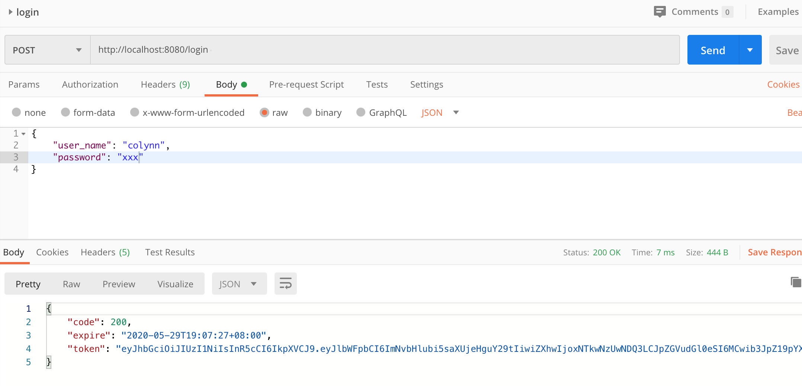
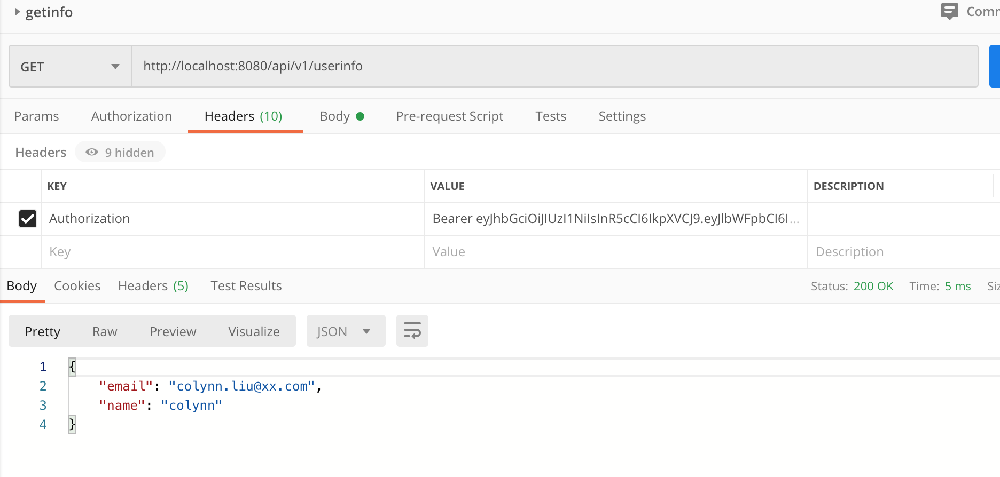
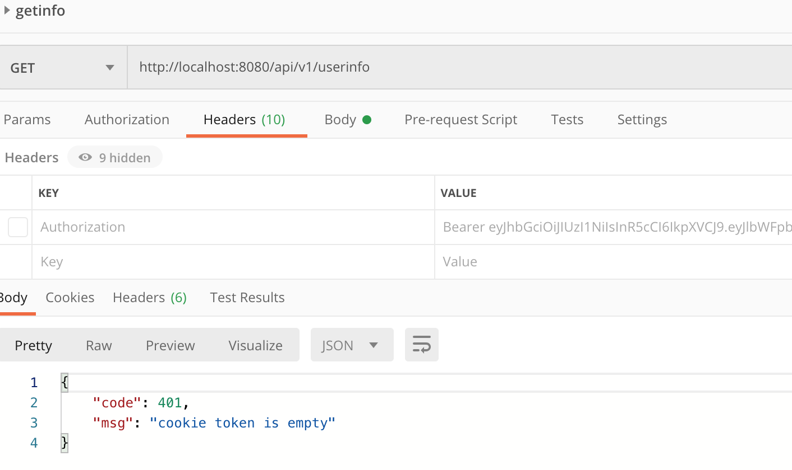

## jwt-demo

### 运行demo

```
$ go mod vendor
$ go mod download

$ go run main.go

```

### 验证-login


### when add token


### when miss token 


## Refer to
* [JWT Middleware for Gin Framework](https://github.com/appleboy/gin-jwt)
